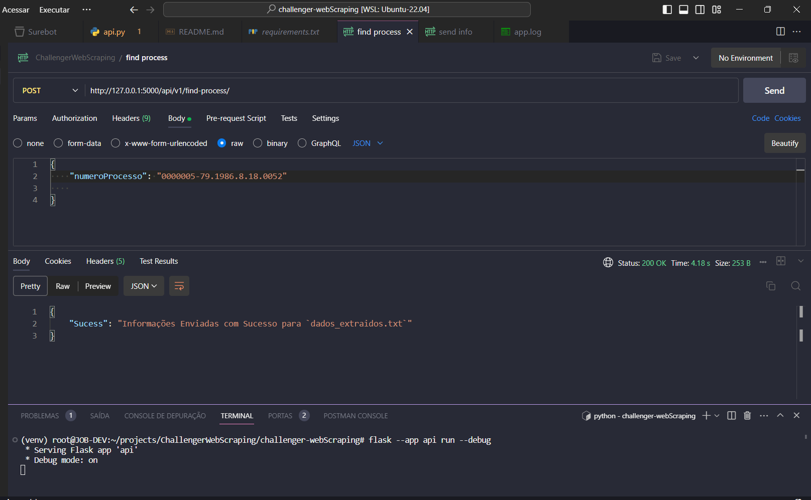
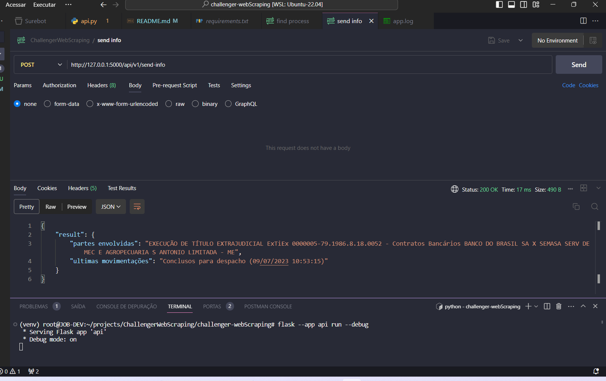
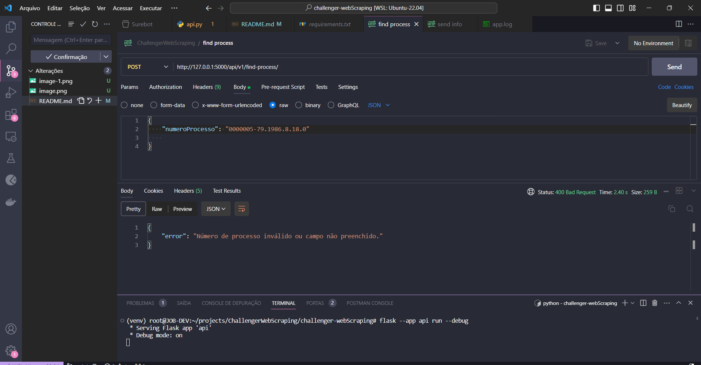

# TJPI Web Scraper

## Descrição
Este projeto é um web scraper que extrai informações de processos judiciais do Tribunal de Justiça do Piauí (TJPI) a partir do site de consulta pública.

## Funcionalidades
- Captura cookies da sessão para autenticação em cada requisição.
- Realiza consultas de processos judiciais com base no número do processo.
- Extrai informações, como partes envolvidas e últimas movimentações, dos resultados da consulta.
- Permite o envio das informações extraídas para outra rota via POST.

## Pré-requisitos
- Python 3.6 ou superior
- Bibliotecas Python: Flask, lxml, requests

## Instalação
1. Clone este repositório para o seu ambiente local.
2. Instale as dependências do Python executando `pip install -r requirements.txt`.
2. Instale as dependências do Python executando `pip install Flask`.
2. Instale as dependências do Python executando `pip install lxml`.

## Como Usar
- Execute o comando `flask --app api run --debug` para iniciar o servidor Flask.
- A porta padrão do flask é a `5000`, mas você pode utilizar outra para iniciar o servidor Flask.
- Exemplo de rota a ser seguida: `http://127.0.0.1:5000/api/v1/find-process/`
- Use uma ferramenta como o Postman para fazer requisições POST para as rotas `/api/v1/find-process/`, `/api/v1/send-info/`, e `/api/v1/receive-info/`.
- Siga a ordem das rotas para extrair, enviar e receber informações dos processos judiciais.
- Para fazer com a rota `find-process` funcione é necessário enviar no corpo da requisição do postman os dados em formato json `{ "numeroProcesso": "0000005-79.1986.8.18.0052" }`
- Abre o postman `raw >> JSON`
- Para funcionar basta apenas chama a rota `/api/v1/find-process/` e a rota em sequencia`/api/v1/send-info/`

## Exemplos
- Consulte os exemplos no código-fonte para entender como usar as rotas.

## Contribuição
- Sinta-se à vontade para contribuir com melhorias, correções de bugs e adições de recursos.
- Abra um problema (issue) ou envie um pedido de pull (pull request) com suas contribuições.

## Licença
Este projeto é distribuído sob a licença MIT. Consulte o arquivo `LICENSE` para obter mais informações.

## Créditos
- Este projeto utiliza as bibliotecas Flask, lxml e requests para web scraping e API de servidor web.

## Status do Projeto
- Este projeto está atualmente em desenvolvimento.

## Screenshots
- 
- 
- Tratamento para numero invalido ou campo vazio 

## Sobre CAPTCHA
- Não encontrei nenhum nesse tipo de consulta
- Único jeito que conheço para quebrar é utilizando APIS, isso é um tipo de conhecimento que irei aprender com pessoas com mais conhecimento que eu.